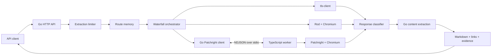
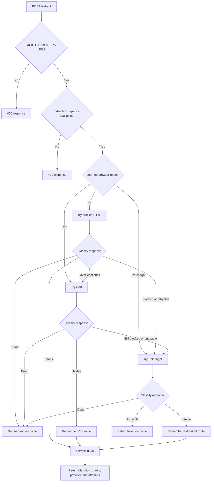
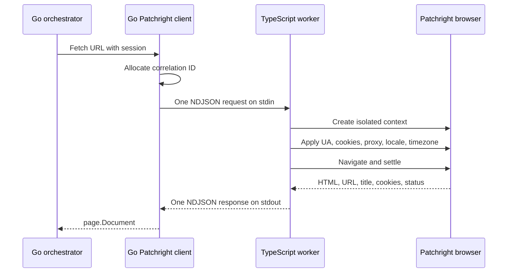
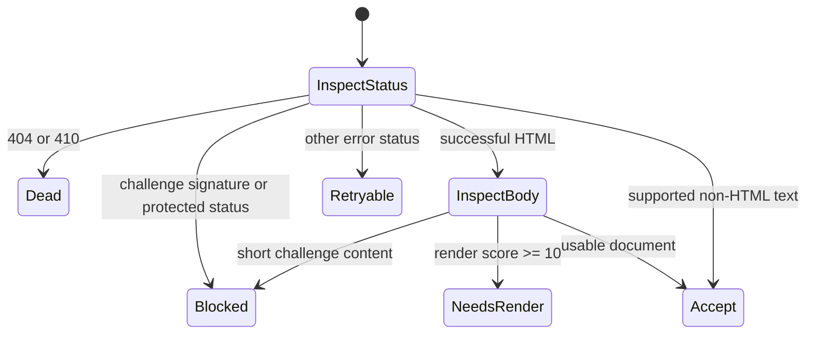
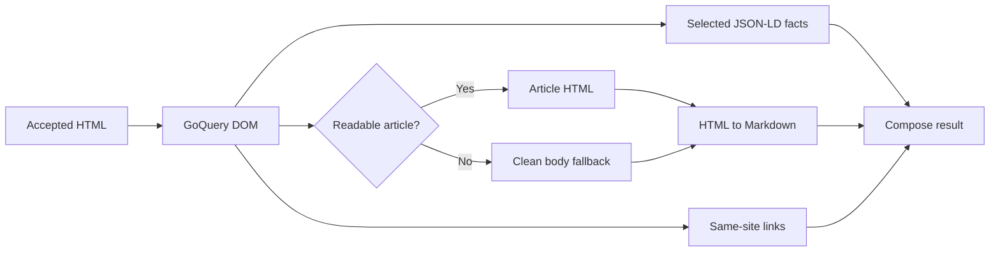
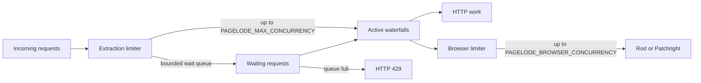
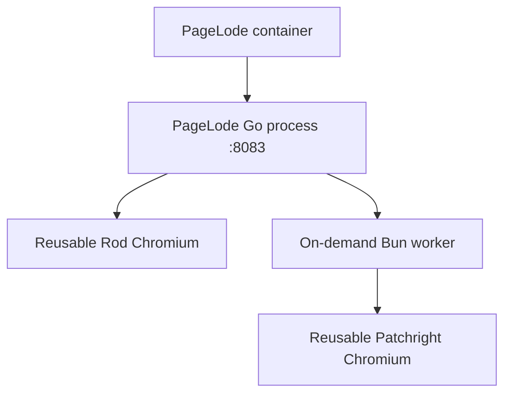

# PageLode architecture

This document describes PageLode's internal design, request lifecycle, browser boundary, escalation policy, and operational limits.

## Design goals

PageLode is designed around five constraints:

- Keep orchestration and extraction in Go.
- Use the cheapest loader capable of returning real content.
- Treat JavaScript rendering and anti-bot challenges as different problems.
- Never accept a challenge page or empty application shell as successful content.
- Bound request size, execution time, queue depth, browser concurrency, and output size.

## System overview



The Go process owns every product decision. The TypeScript worker can render a URL and return browser state, but it cannot choose targets, select routes, extract content, or decide whether a result is acceptable. The same application graph serves one-shot CLI requests and the long-running HTTP API.

## Request lifecycle



Every loader produces the same internal `page.Document` shape. That keeps classification and extraction independent from transport details.

## The three loaders

### Profiled HTTP

The first attempt uses `bogdanfinn/tls-client` with a current Chrome TLS profile and browser-like request headers. It is the preferred path because it avoids starting or using a browser.

The loader returns the status code, final URL, detected content type, response body, effective user agent, and portable cookies for possible browser escalation. Responses are capped at 12 MiB.

### Rod

Rod handles ordinary JavaScript rendering. PageLode lazily launches one reusable Chromium process and creates a fresh tab for each request. Cookies and the user agent from the HTTP attempt are carried into the tab when available.

Rod is used for application shells and pages whose useful content is created after JavaScript runs. It is not treated as the stealth path.

### Patchright

Patchright handles confirmed challenge pages, protected domains, and failures that warrant the most expensive local loader. It runs behind a small TypeScript worker because Patchright's maintained API is in the JavaScript ecosystem.

The worker lazily launches Chromium, creates an isolated browser context for each job, applies the proxy and session state, renders the page, makes a bounded attempt to settle visible challenges, and returns HTML plus updated cookies.

## Go-to-TypeScript boundary



Requests and responses are newline-delimited JSON. A correlation ID allows multiple requests to be in flight through one long-lived worker process. Writes are serialized, while render jobs may run concurrently within the configured browser limit.

The boundary deliberately exposes browser facts rather than extraction policy.

### Request shape

```json
{
  "id": "42",
  "url": "https://example.com",
  "timeout_ms": 45000,
  "wait_until": "domcontentloaded",
  "user_agent": "Mozilla/5.0 ...",
  "cookies": [],
  "proxy_url": "",
  "settle_challenge": true
}
```

### Response shape

```json
{
  "id": "42",
  "ok": true,
  "data": {
    "status_code": 200,
    "final_url": "https://example.com/",
    "title": "Example Domain",
    "html": "<!doctype html>...",
    "user_agent": "Mozilla/5.0 ...",
    "cookies": []
  }
}
```

If the worker exits, the Go client fails all pending calls and starts a new worker on the next request. Cancellation removes the abandoned correlation ID so a late response cannot block the reader.

## Classification

Classification occurs after every attempt and returns one of five states:

| State | Meaning | Typical next action |
|---|---|---|
| `accept` | The response contains usable content | Extract it |
| `needs_render` | The response resembles a JavaScript shell | Try Rod |
| `blocked` | The response contains strong challenge evidence | Try Patchright |
| `retryable` | The response failed without proving it is permanently absent | Escalate |
| `dead` | The target returned 404 or 410 | Stop |

Block detection combines HTTP status with structural signatures for Cloudflare, Akamai, PerimeterX, DataDome, Imperva, Sucuri, CAPTCHA pages, and short access-denial responses.

JavaScript-render detection uses weighted evidence rather than a single text check. Signals include hydration markers, empty application roots, script-heavy documents with little visible text, inline DOM mutation, missing semantic content, and explicit JavaScript requirements. A score of 10 or more triggers rendering.



## Content extraction

Accepted HTML remains in Go for deterministic processing:

1. Parse the document with GoQuery.
2. Attempt article extraction with Readeck's Go Readability implementation.
3. If the readable article is too small, clean the body and convert it to Markdown.
4. Add selected JSON-LD and page-description facts.
5. Collect, normalize, deduplicate, and sort up to 100 same-site links.
6. Limit returned Markdown to 12,000 Unicode characters.



## Route memory

When Rod or Patchright succeeds, PageLode remembers that provider for the hostname. A later request to the same host can begin at the known working browser layer instead of repeating cheaper attempts that are likely to fail.

Entries expire after `PAGELODE_ROUTE_TTL`. The store is process-local by design; there is no external database in the current architecture. Configured protected domains are pre-seeded to Patchright, and subdomains inherit their parent-domain rule.

## Concurrency and backpressure



The extraction limiter bounds complete request lifetimes. A second limiter independently protects browser capacity. Both share the configured maximum waiting depth, and the API rejects overload instead of allowing unbounded memory growth.

Request contexts carry deadlines through the API, orchestrator, loaders, browser queue, and worker response wait.

## Package map

| Path | Responsibility |
|---|---|
| `cmd/pagelode` | CLI parsing, process wiring, HTTP lifecycle, graceful shutdown |
| `internal/api` | HTTP contract, validation, timeouts, health reporting |
| `internal/orchestrator` | Waterfall, attempt evidence, escalation, final results |
| `internal/httpfetch` | Profiled direct HTTP loader and session capture |
| `internal/rodfetch` | Ordinary JavaScript rendering with Rod |
| `internal/patchright` | Managed subprocess client and NDJSON multiplexing |
| `internal/classify` | Block, render, retry, dead, and accept decisions |
| `internal/extract` | Readability, DOM cleanup, Markdown, links, structured data |
| `internal/memory` | Expiring hostname-to-provider routes |
| `internal/limit` | Bounded concurrency and queueing |
| `internal/page` | Loader-neutral document and session values |
| `browser/src` | Patchright worker and runtime contract validation |

## Failure behaviour

Each attempt records its provider, duration, status, classification, render score, and a concise detail. Transport errors are evidence too. PageLode returns a structured `failed` or `dead` result when the waterfall completes without usable content; malformed API requests and capacity failures use HTTP error statuses.

This separation makes an extraction failure observable without pretending that block-page HTML is valid content.

## Deployment model

The provided container builds a static Go binary, installs Bun and Chromium, installs Patchright's Chromium build, and runs both language layers in one service container. The TypeScript worker remains a child process of PageLode rather than a separately deployed network service. The image defaults to `pagelode serve`; supplying a URL instead runs a one-shot extraction.



This is the smallest deployment that preserves the maintained Patchright implementation while keeping orchestration in Go.

## Current limitations

- PDF extraction is not implemented.
- Route memory is not shared between replicas.
- Browser contexts are isolated, but named persistent sessions are not implemented.
- Challenge interaction is intentionally small and cannot solve every protection system.
- Proxy credentials are supported but proxy quality and browser fingerprint coherence remain deployment concerns.
- There is no authentication layer in front of the HTTP API yet.

The planned path from the existing OpenExtract service is documented in [migration.md](migration.md).
