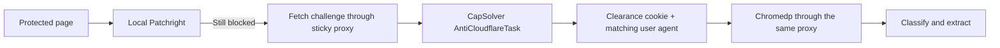

# Cloudflare fallback status

Status recorded on 12 September 2026.

## Current implementation

PageLode now has an optional CapSolver fallback after Patchright:



The integration is implemented in Go. It creates an `AntiCloudflareTask`, polls for completion within the request deadline, preserves the proxy identity, merges the returned cookies into the browser session, and records `capsolver` as an observable provider. API keys and proxy credentials are excluded from diagnostic output.

CapSolver is enabled only when both `CAPSOLVER_API_KEY` and either `PAGELODE_CAPSOLVER_PROXY_URL` or `PAGELODE_PROXY_URL` are available.

## What was verified

- CapSolver accepts the live Crunchbase challenge when an API-generated sticky Evomi Core Residential proxy is used.
- A completed task returns one clearance cookie and a Chrome 150 user agent matching the challenge request.
- Chromedp can authenticate to the residential proxy and receive the solved session.
- One run reached a normal page titled `Crunchbase` and returned 341 characters, proving the end-to-end handoff can pass Cloudflare.
- The full Go tests, race detector, vet, TypeScript type check, and worker tests pass.
- The installed `pagelode` binary contains the new integration.

## What is not yet reliable

Repeated requests to the OpenAI company page still commonly finish on `Just a moment...` with a Cloudflare challenge. The earlier 341-character success was generic Crunchbase content, not a verified extraction of the OpenAI company profile.

The current sequence uses Chromedp after CapSolver. It does not inject the solved session back into Patchright. This is the main experiment to try next because it keeps the stealth browser layer involved after solving.

Proxy behavior observed during testing:

- A generic rotating proxy hostname was rejected by CapSolver as dynamic DNS.
- Reusing manually assembled proxy credentials produced remote proxy-authentication failures even though those credentials worked locally.
- Proxies generated through Evomi's public API were accepted by CapSolver, but their clearance success on Crunchbase was intermittent.
- Evomi's managed scraper endpoint returned `401` with the currently available API key, so that account is not presently usable as a scraper fallback.

No successful OpenAI Crunchbase profile data should be claimed from the current tests.

## Next implementation steps

1. Add a dedicated Patchright client for the solver proxy and inject CapSolver's returned user agent and cookies into it.
2. Give that worker a separate persistent profile directory so it cannot collide with the normal Patchright process.
3. Restore an optional user-agent field at the private worker boundary and apply it when launching the solver-specific browser context.
4. Retry with a newly generated sticky proxy when the solved response is still classified as blocked.
5. Add a content assertion for the requested Crunchbase organization so a generic Crunchbase shell cannot count as success.
6. Keep retries bounded to control CapSolver credits and proxy traffic.

## Safe test command

```sh
PAGELODE_DEBUG=true pagelode --json https://www.crunchbase.com/organization/openai
```

Debug output contains provider, status, timing, cookie count, and browser major version without secret values.
