# Cloudflare status

Status recorded on 5 October 2026.

## How PageLode handles a challenge

```mermaid
flowchart LR
    Target[Protected page] --> HTTP[HTTP request]
    HTTP -->|Challenge| Patchright[Patchright: real Chrome]
    Patchright -->|Still blocked| Bootstrap[Fetch challenge through sticky proxy]
    Bootstrap --> CapSolver[CapSolver AntiCloudflareTask]
    CapSolver --> Session[Clearance cookie + matching user agent]
    Session --> Chromedp[Chromedp through the same proxy]
    Chromedp --> Classifier[Classify and extract]
```



Patchright is the primary path. CapSolver is an optional last resort, enabled only when `CAPSOLVER_API_KEY` and either `PAGELODE_CAPSOLVER_PROXY_URL` or `PAGELODE_PROXY_URL` are set.

## Requirements

Patchright passes Cloudflare's standard challenge page when:

1. Chrome runs with a visible window: `PAGELODE_PATCHRIGHT_HEADLESS=false`.
2. Chrome keeps its native locale and timezone. PageLode no longer overrides them, because Cloudflare detects emulated values.
3. The connection uses no proxy, or a sticky proxy session that keeps one IP for the whole run.

The proxy can come from any provider. Setup instructions are in [configuration](configuration.md#proxies).

## Test results

Target: `https://www.scrapingcourse.com/cloudflare-challenge`, a public Cloudflare test page. CapSolver disabled.

| Setup | Result |
|---|---|
| No proxy, visible Chrome | 8 of 8 passed in 1.5 to 3.4 seconds |
| No proxy, headless Chrome | 0 of 3 passed |
| Sticky mobile proxy, any country, visible Chrome | 2 of 2 passed in 7 to 10 seconds |
| Sticky mobile proxy, UK exit, visible Chrome | 2 of 2 passed in 10 to 21 seconds |
| Sticky mobile proxy, US exit, visible Chrome | 2 of 2 passed in about 9 seconds |
| Proxy with a new IP for every connection | 0 of 1 passed |

Before the locale and timezone override was removed, Patchright failed every run, with or without a proxy.

## CapSolver results

CapSolver returned a `cf_clearance` cookie on every task, but Cloudflare accepted it on only 1 of 9 replays. Using the same sticky IP, the exact solved user agent, and a Chrome TLS fingerprint did not change that. The fallback is unreliable and should not be relied on when Patchright can pass.

CapSolver rejects proxies it cannot authenticate before solving. It requires a sticky proxy with a username and password.

## Known gaps

- The Docker image runs headless, so containers do not pass the challenge yet. Running visible Chrome on a virtual display such as Xvfb is the likely fix.
- Each server process keeps one proxy session until restart. Only CLI runs get a new session automatically.
- Crunchbase has not been retested since the locale fix.

## Test command

```sh
PAGELODE_DEBUG=true PAGELODE_PATCHRIGHT_HEADLESS=false \
pagelode --json https://www.scrapingcourse.com/cloudflare-challenge
```

Debug output contains provider, status, timing, cookie count, and browser major version without secret values.
